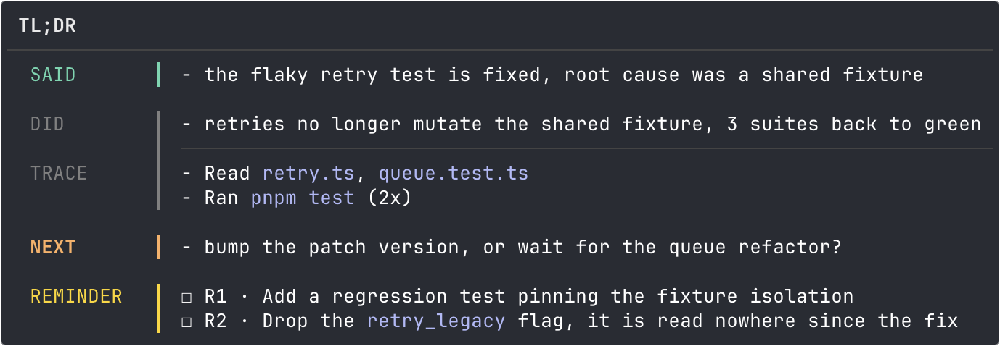

<p align="center">  </p>

# @tayomi/cc-views

**Colour and layout for Claude Code's answers: boxes, aligned columns and coloured status chips, drawn live in your terminal.**



*A production view from TAYOMI's own turn reports, drawn by this engine. Write your own `.view` and the quickstart below gets you there.*

> The model never draws any of it.  
> The agent writes a compact block of plain data.  
> A MessageDisplay hook dresses it through a `.view` template you own.  
> Presentation costs the model zero tokens, and the transcript keeps plain text.

## Features

**✨ What matters gets seen.**  
Titled frames, aligned rows, coloured chips: the answer stops looking like the scroll.

**✨ Zero tokens on presentation** (minus one decorator line).  
Not one extra token for the model: nothing that is drawn ever enters its context window.

**✨ Nothing to write to start.**  
Columns, ruled rows, framed summaries, bands, quotes and rules ship with the package. Yours come later.

**✨ Fail-open.**  
A failing view shows its original text in place, the rest still renders. Never a blank.

**✨ Block or markdown.**  
A fenced `view:` block, or a decorator over markdown that survives without any hook.

**✨ Yours always wins.**  
Ordered directories resolve `.view` files: name one the same and yours beats a plugin's.

**✨ One template, any tone.**  
`type:warning` or `tone:dim` recolours a view where it stands, like a class. No second file.

**✨ Your palette.**  
`extendTags` adds your own `{{tags}}` process-wide, and yours shadow the built-ins.

## Minimal installation

1. **Install:**

   ```bash
   npm install -D @tayomi/cc-views
   ```

2. **Wire the hook** in your project's `.claude/settings.json` (or your plugin's `hooks/hooks.json`, same shape), then restart Claude Code:

   ```json
   {
     "hooks": {
       "MessageDisplay": [
         { "hooks": [
            { "type": "command", "command": "${CLAUDE_PROJECT_DIR}/node_modules/.bin/cc-views-messagedisplay" }
         ] }
       ],
       "SessionStart": [
         { "matcher": "startup|clear|compact|resume", "hooks": [
            { "type": "command", "command": "${CLAUDE_PROJECT_DIR}/node_modules/.bin/cc-views-session start" }
         ] }
       ],
       "SessionEnd": [
         { "hooks": [
            { "type": "command", "command": "${CLAUDE_PROJECT_DIR}/node_modules/.bin/cc-views-session end" }
         ] }
       ]
     }
   }
   ```

   The two session lines are OPTIONAL bookends. When several engines are installed (a plugin's, a project's), each view
   is drawn by exactly one of them, elected per session: SessionStart signs the roster, SessionEnd tears it down, and a
   first message finding no roster recreates it, so nothing breaks without them.

3. **Copy/paste this prompt:**

   ```
   Answer me "@{view:welcome}", nothing else.
   ```

   A coloured, titled box closes the setup. Press `Ctrl+O` (`Cmd+O` on macOS) to see the raw transcript: the model wrote one plain line. Ask for it again after any Claude Code update, and it says whether the hook is still alive.

## Write your own view

### Use the skill

The `write-view` skill is the **fastest** way: it teaches your agent the whole procedure, and it installs from this repo, not from npm. It carries the skill, never the engine: the hook above draws, this teaches. Install both.

```bash
# as a plugin
/plugin marketplace add mopi1402/tayomi-cc-views
/plugin install cc-views@tayomi-cc-views

# or straight into .claude/skills/
npx skills add https://github.com/mopi1402/tayomi-cc-views
```

Then ask for what you want drawn, in plain words. The agent does the rest.

### Or write it yourself

1. **Write a template**, a `.view` file in your project's `views/` directory (this one is [`examples/demo.view`](examples/demo.view)):

   ```
   @map verdicts ok=pass warn=warn fail=fail
   @fields checks verdict name detail
   @box
   @head ${service} deploy
   @right ${env}
   @each checks label="CHECKS"
   ${#label}  ${verdict:verdicts} ${name}  ${detail}
   @end
   @endbox
   ```

2. **Teach the agent.** Nothing draws until the model writes its half. Put this in your system prompt or `CLAUDE.md`:

   > For a deploy check, emit a fenced block whose language is `view:demo`, carrying plain `key: value` lines and `key:` + `- item` lists.

3. **Ask for a report.** The agent then writes:

   ````
   ```view:demo
   service: payments
   env: staging
   checks:
   - ok build the bundle compiles
   - warn tests 2 flaky suites skipped
   - fail lint 3 errors in api.ts
   ```
   ````

   and the screen draws a box titled `payments deploy`, badged `staging`, one aligned row per check, each verdict a coloured chip. To learn the language by example, read [`views/welcome.view`](views/welcome.view): it is commented line by line, and your agent can read it too.

**Nothing here decides WHEN.** The instruction asks, it does not guarantee. For a view that must appear at a fixed moment, a turn's closing summary for instance, pair it with a Stop hook that refuses to end the turn while the block is missing. TAYOMI's own tl;dr is gated that way, and gives up after three attempts.

## Prefer plain markdown? Use the decorator

A fenced block's fallback is a code wall. The decorator flips the trade: **the payload is markdown that stands on its own**, so anywhere the hook does not run, the reader still gets a real block.

Six ready-made views ship for it, and your agent needs to be told they exist. (`welcome`, above, is not one of them: it is the health check saying cc-views is wired and still alive, never a view you draw with.) **Installed as a plugin, it already is**: a `SessionStart` hook puts [`agent/steering.md`](agent/steering.md) into the session on every start, clear, compact and resume, so there is nothing to paste and nothing that goes stale in a file of yours.

Using the package alone, with a hook of your own, there is no `SessionStart` to carry it. Paste [`agent/steering.md`](agent/steering.md) into your system prompt or `CLAUDE.md` then: it is that same text, kept honest by a gate that reads every view name in it back against what this package actually ships.

On screen the decorator line disappears, and the same markdown has two readings: the name you write is what picks one. The marker, `@text`, `type:`, `tone:` and the typed forms are specified in [the language reference](docs/architecture/view-language.md).

What each degrades to, where the hook is absent:

| Payload | Re-rendered as markdown | Read raw in a transcript |
| --- | --- | --- |
| Fenced `view:` block | a code wall | a code wall |
| Table under a decorator | a native table, one stray line above it | a table, one stray line above it |
| Alert quote under a decorator | a native alert box for `NOTE`, `TIP`, `IMPORTANT`, `WARNING`, `CAUTION`; an ordinary quote otherwise | a quote whose first line names its kind |
| Decorator with no payload (`hr`) | nothing: the bare line shows | the bare line shows |

## Configuration

Five environment variables, all optional.

| Variable | Takes | Does |
| --- | --- | --- |
| `CC_VIEWS_PATH` | dirs, split like `PATH` | searched before `./views` and the bundled ones; first hit wins |
| `CC_VIEWS_WIDTH` | a positive number | the width boxes are drawn to, instead of the terminal's |
| `CC_VIEWS_THEME` | `light`, `dark`, or either with `-ansi` or `-daltonized` | the theme, instead of the one detected |
| `CC_VIEWS_STEERING` | `off`, `0`, `false`, `no` | silences the plugin's `SessionStart` briefing; the skill and the engine stay |
| `CC_VIEWS_ENGINES_DIR` | a directory | where engines register for the per-view election, instead of the machine-wide directory; for test harnesses, whose engines then elect among themselves |

## Use it in your plugin or framework

The bin is only the zero-config storey: everything it does is public API, so a plugin ships its own hook file, its own views and its own palette:

```ts
import { ansi256, extendTags, runMessageDisplayHook } from "@tayomi/cc-views";

extendTags({ brand: ansi256(75) }); // {{brand}}, and {{brand_bg}}/{{brand_cap}} derived from it

await runMessageDisplayHook(undefined, {
  viewsPath: ["./views", "/path/to/my-plugin/views"], // first hit wins
});
```

`viewsPath` order is your policy: list the consumer's directory first and your users can shadow any of your views by simply naming a file the same. Append `bundledViewsDir()` last to keep `view:welcome` (the health check) resolvable through your hook too. For tests, `handleMessageDisplay(payload, host?, options?)` takes a parsed payload and returns the output string (or `null`) with no stdin/stdout anywhere. Width, state dir and the rest of `RenderOptions` are covered in the [integration reference](docs/architecture/display-host.md).

## Documentation

[All of it, sorted by what you are doing](docs/index.md). If you read one page, make it the [Cheatsheet](docs/CHEATSHEET.md): the whole language on one screen, with a worked example.

---

*This engine is a carved-out open-source piece of TAYOMI, my own AI SDLC framework, which draws every one of its views through it.*
