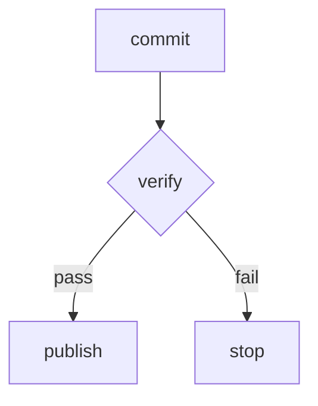

@{view:split}

```mermaid
flowchart TD
    A[commit] --> B{verify}
    B -->|pass| C[publish]
    B -->|fail| S[stop]
```
```markdown
## The release gate
- every commit runs **verify**
- green, it is published
- red, nothing leaves
```
